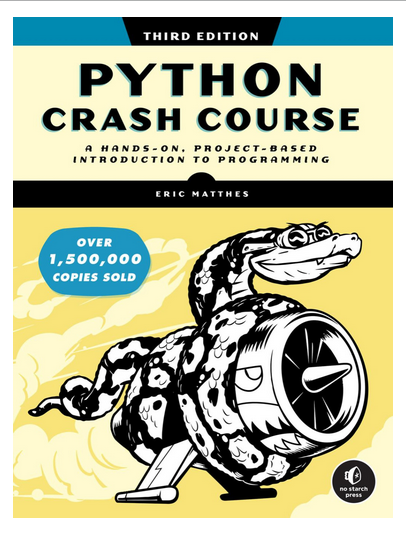

# python_crash_course

This repository documents my journey through "Python Crash Course, 3rd Edition" by Eric Matthes. It includes completed chapters, exercises, well-commented code, and additional projects. The goal is to create a personal reference, showcase my skills for potential employers, and provide a helpful guide for other learners.

